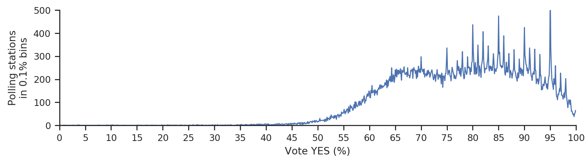

# Statistical anomalies in Russian elections

Raw election data for all Russian federal elections from 2000 to 2020 can be found in `data/`. Data scraped by Sergey Shpilkin.

Literature:

* Kobak, D., Shpilkin, S., & Pshenichnikov, M. S. (2016). [Integer percentages as electoral falsification fingerprints](https://projecteuclid.org/euclid.aoas/1458909907). *The Annals of Applied Statistics*, 10(1), 54--73.
* Kobak, D., Shpilkin, S., & Pshenichnikov, M. S. (2016). [Statistical fingerprints of electoral fraud?](http://onlinelibrary.wiley.com/doi/10.1111/j.1740-9713.2016.00936.x/full) *Significance*, 13(4), 20--23.
* Kobak, D., Shpilkin, S., & Pshenichnikov, M. S. (2018). [Putin's peaks: Russian election data revisited](https://rss.onlinelibrary.wiley.com/doi/10.1111/j.1740-9713.2018.01141.x). *Significance*, 15(3), 8--9.
* Kobak, D., Shpilkin, S., & Pshenichnikov, M. S. (2020). [Suspect peaks in Russia's “referendum” results](https://rss.onlinelibrary.wiley.com/doi/abs/10.1111/1740-9713.01438). *Significance*, 17(5), 8--9.

Analysis for the Significance 2018 paper is available in [significance2018/elections2018.ipynb](https://github.com/dkobak/elections/blob/master/significance2018/elections2018.ipynb).

Analysis for the Significance 2020 paper is available in [significance2020/referendum2020.ipynb](https://github.com/dkobak/elections/blob/master/significance2020/referendum2020.ipynb).

Analysis for the [2018 Meduza article](https://meduza.io/feature/2018/07/03/tak-skolko-golosov-ukrali-na-prezidentskih-vyborah-sotni-tysyach-ili-milliony) with criticism of Kirill Kalinin's and Walter Mebane's work is available in [meduza2018/meduza.ipynb](https://github.com/dkobak/elections/blob/master/meduza2018/meduza.ipynb).
